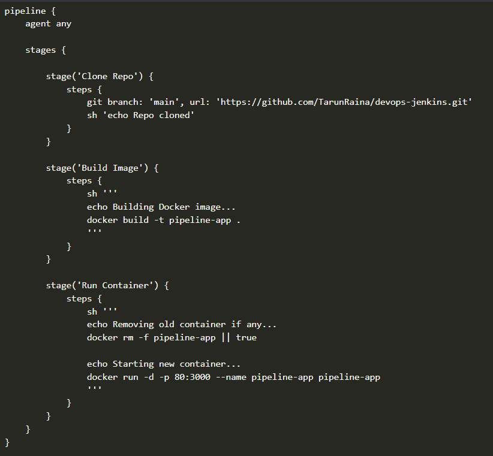
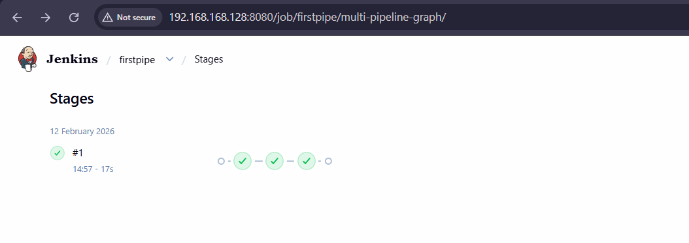
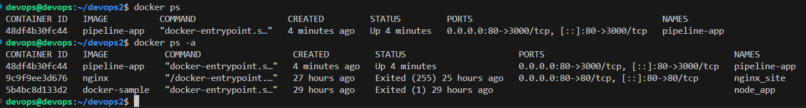
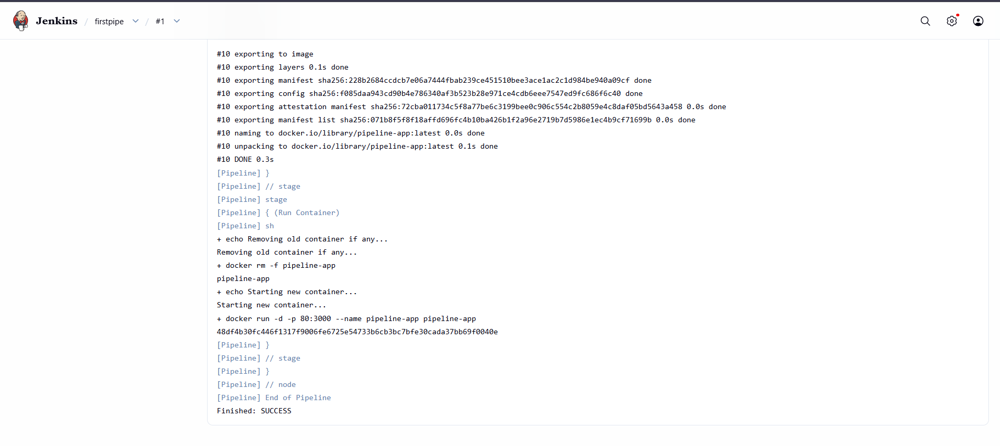

# 🚀 Jenkins + Docker CI/CD Pipeline (Hands-on Implementation)

Author: Tarun Raina  

---

## 📌 Overview

This project demonstrates a complete DevOps workflow:

- Linux shell scripting
- Docker verification and inspection
- React application setup and testing
- Git version control
- Jenkins-based CI/CD pipeline
- Docker image build and automated container deployment

The final result is a **3-stage Jenkins pipeline**:

1. Clone source code
2. Build Docker image
3. Run Docker container

Triggered manually at Stage 1, then fully automated downstream.

---

## 🧱 Environment

- Ubuntu VM
- Docker 29.2.1
- Node.js v18
- OpenJDK 21
- Jenkins
- GitHub

---

## Phase 0 — Initial Script & Environment Validation

### Creating and Running a Shell Script
```
./sample-script.sh
```
Permission denied → fixed via:

```
chmod +x sample-script.sh
./sample-script.sh
```
The script outputs:

Docker version

Docker images

Docker containers

Java version

This validated:

Docker daemon running

Images present

Containers listed

Java installed (required for Jenkins)

Example output:
```
Docker version 29.2.1
docker images
docker ps -a
openjdk 21.0.10
```
Purpose: sanity check before moving into CI/CD.

Phase 1 — React Application Setup
Clone React Repository
```
git clone https://github.com/TarunRaina/react-site-sample-devops.git
cd react-site-sample-devops
```

Install Dependencies
```
npm i
```

Warnings appeared due to Node version mismatch (React Router expects Node ≥20), but the install succeeded.

Run Development Server
```
npm run dev
For LAN exposure:

npx vite --host
```
App became accessible at:

http://<VM-IP>:5173


Modify Package Script + Push Changes
```
git add package.json
git commit -m "Update dev script to host on all interfaces for Linux"
git push origin main
```
This validated:

Local dev flow

Git commit lifecycle

Remote push

Phase 2 — Jenkins + Docker Preparation
Jenkins Docker Permission Fix
Allow Jenkins to execute Docker:

```
sudo usermod -aG docker jenkins
sudo systemctl restart jenkins
sudo systemctl restart docker
```

Verify:
```
sudo su - jenkins
docker ps
```
No permission errors → Jenkins is Docker-capable.


Phase 3 — Application for CI/CD
A minimal Node + Express app was prepared with:

index.html

server.js

package.json

Dockerfile

Pushed to GitHub.

This becomes the pipeline input.

Phase 4 — Jenkins Pipeline Architecture
Instead of a Jenkinsfile, three freestyle jobs were created:

🔹 Job 1 — clone-job (Manual Trigger)
Purpose: pull source code.

SCM → Git

Branch: */main

Build step:
```
echo Clone successful
ls
```

Workspace:
```
/var/lib/jenkins/workspace/clone-job
```


🔹 Job 2 — docker-image-job (Triggered by clone-job)
Trigger:

☑ Build after other projects are built
Upstream: clone-job

Build step:
```
echo "Starting Docker image build..."

cd /var/lib/jenkins/workspace/clone-job

echo "Building Docker image from cloned repo..."

docker build -t pipeline-app .

echo "Docker image pipeline-app created successfully."
This produces:

pipeline-app:latest

```


🔹 Job 3 — docker-run-job (Triggered by docker-image-job)
Trigger:

☑ Build after other projects are built
Upstream: docker-image-job

Build step:

```
echo "Stopping old container if exists..."

docker rm -f pipeline-app || true

echo "Starting new container..."

docker run -d -p 80:3000 --name pipeline-app pipeline-app

echo "Application deployed successfully."
```
This:

Removes old container

Runs new one


Phase 5 — Execution Flow
Only Job 1 is started manually:

clone-job
Then automatically:

clone-job
   ↓
docker-image-job
   ↓
docker-run-job
One click.

Three stages.

Zero micromanagement.

Phase 6 — Validation
Jenkins Logs
Clone successful

Docker image built

Container deployed

Docker Verification
docker ps
Output:
```
CONTAINER ID   IMAGE          PORTS
pipeline-app  pipeline-app  0.0.0.0:80->3000
```
Container alive.

Browser Test
http://<VM-IP>
Application loads successfully.


Phase 7 — Jenkins Pipeline (Declarative)

To streamline the previous 3-job freestyle setup, a declarative Jenkins pipeline was implemented. This provides a single, automated workflow that pulls code, builds a Docker image, deploys a container, and validates the result—all in one pipeline.


Validation:
Workspace shows application files.


Stage 2 — Build Docker Image

Navigates to the workspace.

Builds the Docker image pipeline-app:latest from the repository’s Dockerfile.

Logs the build output for verification.

Example snippet:

sh '''
cd $WORKSPACE
docker build -t pipeline-app .
docker images | grep pipeline-app
'''


Validation:
Docker image appears in docker images.

shows pipeline stage success.

Stage 3 — Run Docker Container

Stops and removes any existing container with the same name.

Runs a new container mapping port 3000 to host port 80.

Confirms container is running.

Example snippet:

sh '''
docker rm -f pipeline-app || true
docker run -d -p 80:3000 --name pipeline-app pipeline-app
docker ps | grep pipeline-app
'''


Validation:
Container is live and accessible via browser.


Stage 4 — Validation

Outputs logs and confirms successful execution of all stages.

Ensures the application is accessible and container is healthy.

Example snippet:

echo "Pipeline executed successfully."
sh 'docker ps | grep pipeline-app'


Validation:
Console shows all stages executed correctly.


✅ Summary

Consolidates the previous freestyle jobs into one automated workflow.

Provides end-to-end CI/CD: GitHub → Jenkins → Docker → Live container.

Manual input needed only to start the pipeline; all downstream stages run automatically.

Fully visible logs and stage view for real-time monitoring.

Ready for future enhancements like automated testing or multi-environment deployment.
